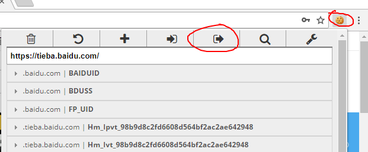
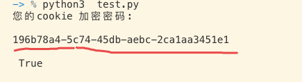
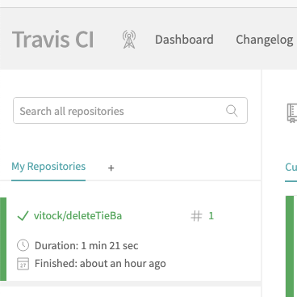
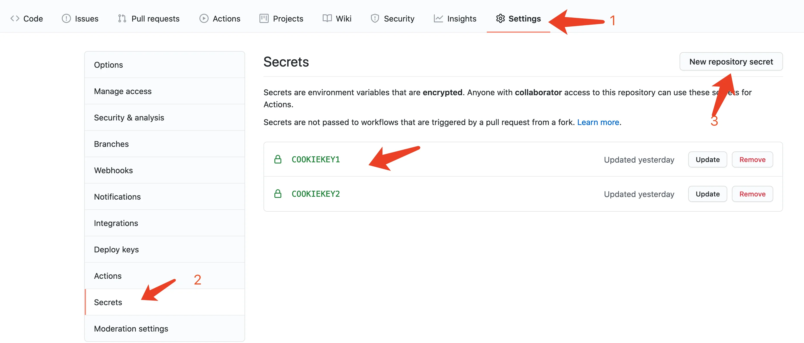

看到有个朋友fork之后把自己的cookie.json 文件也上传了,这样会有存在的泄露信息风险

.gitignore里面写了  忽略这个文件的,不知道他怎么上传的


---
## 改用 github action ,不用注册travis了
 


----

## 感谢 rmb122 的项目[Delete-my-hisroy-in-tieba][3]
~~在此基础上做了一些改动，不需要 vps ，借助免费的[Travis][1] 每天/周自动运行(前提:你的项目是public,所以这里**加密**了cookie)~~
##  1. fork 本项目到你自己的github

##  2. 提取cookie 并加密 cookie
- 打开[贴吧首页](https://tieba.baidu.com/)
- 使用Chrome 的 [EditThisCookie][2] 插件, 可以直接导出 JSON 下的 Cookie  ，保存在项目目录，文件名为 
**cookie.json** 

- 加密cookie(毕竟是public项目) <br>然后在终端运行 (请提前安装python3 )
``` python
pip install -r requirements.txt // 第一次运行需要
python3 test.py
```
- 会自动生成加密的cookie信息，记住终端中打印的加密的key留作下一步使用


-  记住密码,然后吧加密后的cookie推送到github

```
git add .
git commit "加密后的cookie"
git push origin master
```
## ~~3. 注册 [Travis][1] (可能要翻墙 ??)~~ 添加环境变量
<!-- - 直接用github账号注册就可以了.
- 然后在控制面板中 点击 "+"链接你的项目
如图 
 -->


- 添加环境变量
   在 项目 setting  - secrets 中添加  COOKIEKEY1 COOKIEKEY1

   


- 添加环境变量和定时任务  也就是 上面生成的随机密码
    添加两个环境变量 COOKIEKEY1  COOKIEKEY2

```
例如你的密码是  123456,那么COOKIEKEY2 是最后一位
COOKIEKEY1 12345
COOKIEKEY2 6

```

---

 
  
# config.json

相当于设置, 不同项对应不同的行为, 其中  
`thread` 对应主题帖  
`reply` 对应回复  
`followedBa` 对应关注的吧  
`concern` 对应关注  
`fans` 对应粉丝  
  
例如将  
```json
"thread": {
        "enable": true,
        "start": 1,
        "end": 5
    },
```
改为  
```json
"thread": {
        "enable": false,
        "start": 2,
        "end": 6
    },
```
后, 将不会删除主题帖, 且删除范围将从在 [http://tieba.baidu.com/i/i/my_tie](http://tieba.baidu.com/i/i/my_tie) 的 `1-5` 页变为 `2-6` 页  
其他同理, 默认全部开启, 在删除完后可以自行调整关闭, 加快速度.  


~~帖子多的话可以放在 vps 上每天自动运行, 加入到计划任务中就可以啦~~
PS: 记得根据自己的情况调整在文件中的搜索回复贴子的起始和结束页码 (百度有各种奇葩的 bug)  
PS2: 觉得好用的话点个 `Star` 吧 \_(:з」∠)\_  
~~PS3: 还有疑问, 或者遇到 `bug` 的话可以在 `issues` 里提出, 有空的话我会尽量解决的~~

[1]: https://travis-ci.org/
[2]: https://chrome.google.com/webstore/detail/editthiscookie/fngmhnnpilhplaeedifhccceomclgfbg
[3]: https://github.com/rmb122/Delete-my-hisroy-in-tieba/blob/master/Guide.md
